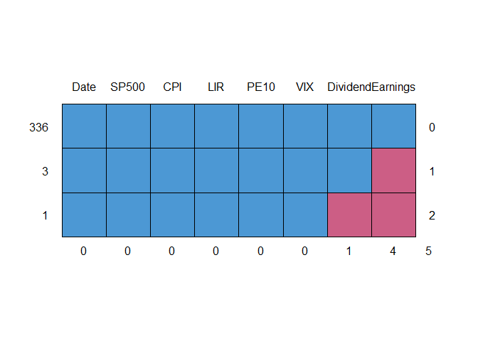
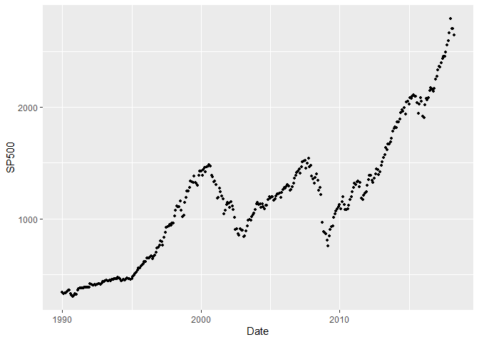
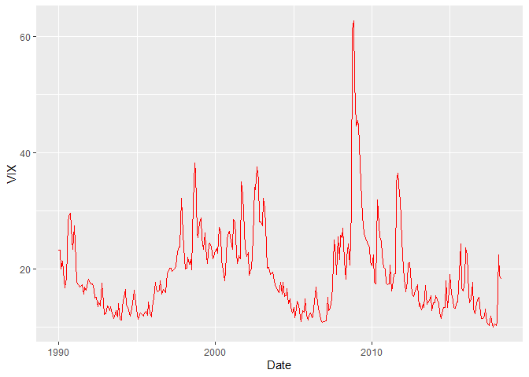
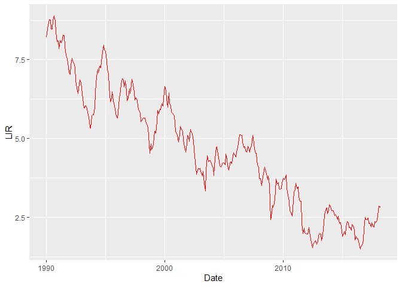
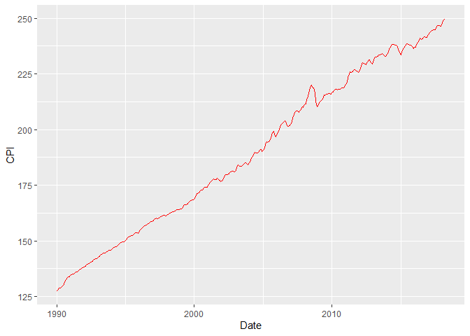
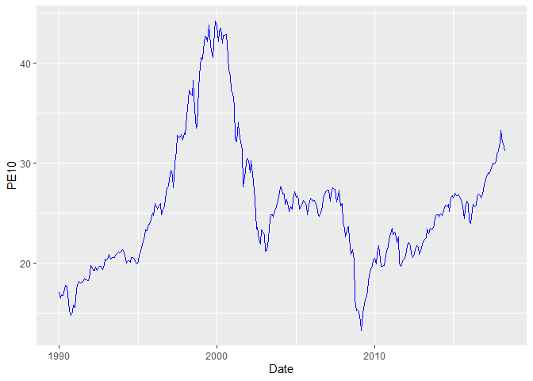
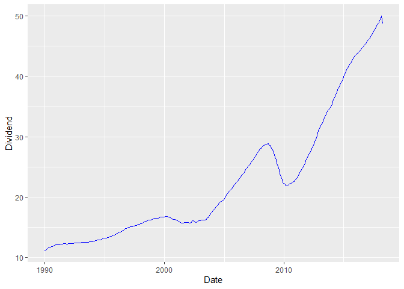
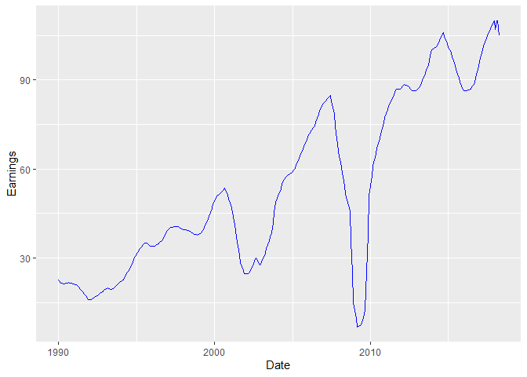

    library(tidyverse)
    library(ggfortify)
    library(lubridate)
    library(bsts)

    ## Warning: package 'bsts' was built under R version 4.0.5

    ## Warning: package 'BoomSpikeSlab' was built under R version 4.0.5

    ## Warning: package 'Boom' was built under R version 4.0.5

    ## Warning: package 'MASS' was built under R version 4.0.4

    ## Warning: package 'xts' was built under R version 4.0.5

    library(mice)

    ## Warning: package 'mice' was built under R version 4.0.5

# Data Preparing

    data = read.csv("../data/sp500.csv")
    vix = read.csv("../data/VIX_History.csv")
    data$Date = as.Date(data$Date)
    vix$DATE = as.Date(vix$DATE, format = "%m/%d/%Y")

    vix = vix %>% 
      group_by(Date=floor_date(DATE, "month")) %>%
      summarize(VIX=mean(CLOSE)) %>%
      filter(Date < "2018-05-01")
    head(vix, 10)

    ## # A tibble: 10 x 2
    ##    Date         VIX
    ##    <date>     <dbl>
    ##  1 1990-01-01  23.3
    ##  2 1990-02-01  23.3
    ##  3 1990-03-01  20.1
    ##  4 1990-04-01  21.4
    ##  5 1990-05-01  18.1
    ##  6 1990-06-01  16.8
    ##  7 1990-07-01  18.4
    ##  8 1990-08-01  28.2
    ##  9 1990-09-01  29.1
    ## 10 1990-10-01  29.6

    data = data %>% filter(Date > "1989-12-01")
    head(data, 10)

    ##          Date  SP500 Dividend Earnings Consumer.Price.Index Long.Interest.Rate
    ## 1  1990-01-01 339.97    11.14    22.49                127.4               8.21
    ## 2  1990-02-01 330.45    11.23    22.08                128.0               8.47
    ## 3  1990-03-01 338.46    11.32    21.67                128.7               8.59
    ## 4  1990-04-01 338.18    11.44    21.53                128.9               8.79
    ## 5  1990-05-01 350.25    11.55    21.40                129.2               8.76
    ## 6  1990-06-01 360.39    11.66    21.26                129.9               8.48
    ## 7  1990-07-01 360.03    11.73    21.42                130.4               8.47
    ## 8  1990-08-01 330.75    11.78    21.58                131.6               8.75
    ## 9  1990-09-01 315.41    11.83    21.74                132.7               8.89
    ## 10 1990-10-01 307.12    11.93    21.61                133.5               8.72
    ##    Real.Price Real.Dividend Real.Earnings  PE10
    ## 1      666.69         21.85         44.10 17.05
    ## 2      644.99         21.92         43.10 16.51
    ## 3      657.03         21.97         42.07 16.83
    ## 4      655.46         22.17         41.74 16.81
    ## 5      677.28         22.34         41.38 17.39
    ## 6      693.13         22.43         40.89 17.82
    ## 7      689.79         22.47         41.04 17.75
    ## 8      627.91         22.37         40.97 16.17
    ## 9      593.83         22.27         40.93 15.30
    ## 10     574.75         22.32         40.44 14.82

    data = inner_join(data, vix) %>% 
      rename(CPI = Consumer.Price.Index,
             LIR = Long.Interest.Rate) 

    ## Joining, by = "Date"

    data = data %>% dplyr::select(Date, SP500, CPI, LIR, PE10, VIX, Dividend, Earnings)

    md.pattern(data)

    ##     Date SP500 CPI LIR PE10 VIX Dividend Earnings  
    ## 336    1     1   1   1    1   1        1        1 0
    ## 3      1     1   1   1    1   1        1        0 1
    ## 1      1     1   1   1    1   1        0        0 2
    ##        0     0   0   0    0   0        1        4 5

    tempData = mice(data,m=5,maxit=50,meth='pmm',seed=500)

    ## 
    ##  iter imp variable
    ##   1   1  Dividend  Earnings
    ##   1   2  Dividend  Earnings
    ##   1   3  Dividend  Earnings
    ##   1   4  Dividend  Earnings
    ##   1   5  Dividend  Earnings
    ##   2   1  Dividend  Earnings
    ##   2   2  Dividend  Earnings
    ##   2   3  Dividend  Earnings
    ##   2   4  Dividend  Earnings
    ##   2   5  Dividend  Earnings
    ##   3   1  Dividend  Earnings
    ##   3   2  Dividend  Earnings
    ##   3   3  Dividend  Earnings
    ##   3   4  Dividend  Earnings
    ##   3   5  Dividend  Earnings
    ##   4   1  Dividend  Earnings
    ##   4   2  Dividend  Earnings
    ##   4   3  Dividend  Earnings
    ##   4   4  Dividend  Earnings
    ##   4   5  Dividend  Earnings
    ##   5   1  Dividend  Earnings
    ##   5   2  Dividend  Earnings
    ##   5   3  Dividend  Earnings
    ##   5   4  Dividend  Earnings
    ##   5   5  Dividend  Earnings
    ##   6   1  Dividend  Earnings
    ##   6   2  Dividend  Earnings
    ##   6   3  Dividend  Earnings
    ##   6   4  Dividend  Earnings
    ##   6   5  Dividend  Earnings
    ##   7   1  Dividend  Earnings
    ##   7   2  Dividend  Earnings
    ##   7   3  Dividend  Earnings
    ##   7   4  Dividend  Earnings
    ##   7   5  Dividend  Earnings
    ##   8   1  Dividend  Earnings
    ##   8   2  Dividend  Earnings
    ##   8   3  Dividend  Earnings
    ##   8   4  Dividend  Earnings
    ##   8   5  Dividend  Earnings
    ##   9   1  Dividend  Earnings
    ##   9   2  Dividend  Earnings
    ##   9   3  Dividend  Earnings
    ##   9   4  Dividend  Earnings
    ##   9   5  Dividend  Earnings
    ##   10   1  Dividend  Earnings
    ##   10   2  Dividend  Earnings
    ##   10   3  Dividend  Earnings
    ##   10   4  Dividend  Earnings
    ##   10   5  Dividend  Earnings
    ##   11   1  Dividend  Earnings
    ##   11   2  Dividend  Earnings
    ##   11   3  Dividend  Earnings
    ##   11   4  Dividend  Earnings
    ##   11   5  Dividend  Earnings
    ##   12   1  Dividend  Earnings
    ##   12   2  Dividend  Earnings
    ##   12   3  Dividend  Earnings
    ##   12   4  Dividend  Earnings
    ##   12   5  Dividend  Earnings
    ##   13   1  Dividend  Earnings
    ##   13   2  Dividend  Earnings
    ##   13   3  Dividend  Earnings
    ##   13   4  Dividend  Earnings
    ##   13   5  Dividend  Earnings
    ##   14   1  Dividend  Earnings
    ##   14   2  Dividend  Earnings
    ##   14   3  Dividend  Earnings
    ##   14   4  Dividend  Earnings
    ##   14   5  Dividend  Earnings
    ##   15   1  Dividend  Earnings
    ##   15   2  Dividend  Earnings
    ##   15   3  Dividend  Earnings
    ##   15   4  Dividend  Earnings
    ##   15   5  Dividend  Earnings
    ##   16   1  Dividend  Earnings
    ##   16   2  Dividend  Earnings
    ##   16   3  Dividend  Earnings
    ##   16   4  Dividend  Earnings
    ##   16   5  Dividend  Earnings
    ##   17   1  Dividend  Earnings
    ##   17   2  Dividend  Earnings
    ##   17   3  Dividend  Earnings
    ##   17   4  Dividend  Earnings
    ##   17   5  Dividend  Earnings
    ##   18   1  Dividend  Earnings
    ##   18   2  Dividend  Earnings
    ##   18   3  Dividend  Earnings
    ##   18   4  Dividend  Earnings
    ##   18   5  Dividend  Earnings
    ##   19   1  Dividend  Earnings
    ##   19   2  Dividend  Earnings
    ##   19   3  Dividend  Earnings
    ##   19   4  Dividend  Earnings
    ##   19   5  Dividend  Earnings
    ##   20   1  Dividend  Earnings
    ##   20   2  Dividend  Earnings
    ##   20   3  Dividend  Earnings
    ##   20   4  Dividend  Earnings
    ##   20   5  Dividend  Earnings
    ##   21   1  Dividend  Earnings
    ##   21   2  Dividend  Earnings
    ##   21   3  Dividend  Earnings
    ##   21   4  Dividend  Earnings
    ##   21   5  Dividend  Earnings
    ##   22   1  Dividend  Earnings
    ##   22   2  Dividend  Earnings
    ##   22   3  Dividend  Earnings
    ##   22   4  Dividend  Earnings
    ##   22   5  Dividend  Earnings
    ##   23   1  Dividend  Earnings
    ##   23   2  Dividend  Earnings
    ##   23   3  Dividend  Earnings
    ##   23   4  Dividend  Earnings
    ##   23   5  Dividend  Earnings
    ##   24   1  Dividend  Earnings
    ##   24   2  Dividend  Earnings
    ##   24   3  Dividend  Earnings
    ##   24   4  Dividend  Earnings
    ##   24   5  Dividend  Earnings
    ##   25   1  Dividend  Earnings
    ##   25   2  Dividend  Earnings
    ##   25   3  Dividend  Earnings
    ##   25   4  Dividend  Earnings
    ##   25   5  Dividend  Earnings
    ##   26   1  Dividend  Earnings
    ##   26   2  Dividend  Earnings
    ##   26   3  Dividend  Earnings
    ##   26   4  Dividend  Earnings
    ##   26   5  Dividend  Earnings
    ##   27   1  Dividend  Earnings
    ##   27   2  Dividend  Earnings
    ##   27   3  Dividend  Earnings
    ##   27   4  Dividend  Earnings
    ##   27   5  Dividend  Earnings
    ##   28   1  Dividend  Earnings
    ##   28   2  Dividend  Earnings
    ##   28   3  Dividend  Earnings
    ##   28   4  Dividend  Earnings
    ##   28   5  Dividend  Earnings
    ##   29   1  Dividend  Earnings
    ##   29   2  Dividend  Earnings
    ##   29   3  Dividend  Earnings
    ##   29   4  Dividend  Earnings
    ##   29   5  Dividend  Earnings
    ##   30   1  Dividend  Earnings
    ##   30   2  Dividend  Earnings
    ##   30   3  Dividend  Earnings
    ##   30   4  Dividend  Earnings
    ##   30   5  Dividend  Earnings
    ##   31   1  Dividend  Earnings
    ##   31   2  Dividend  Earnings
    ##   31   3  Dividend  Earnings
    ##   31   4  Dividend  Earnings
    ##   31   5  Dividend  Earnings
    ##   32   1  Dividend  Earnings
    ##   32   2  Dividend  Earnings
    ##   32   3  Dividend  Earnings
    ##   32   4  Dividend  Earnings
    ##   32   5  Dividend  Earnings
    ##   33   1  Dividend  Earnings
    ##   33   2  Dividend  Earnings
    ##   33   3  Dividend  Earnings
    ##   33   4  Dividend  Earnings
    ##   33   5  Dividend  Earnings
    ##   34   1  Dividend  Earnings
    ##   34   2  Dividend  Earnings
    ##   34   3  Dividend  Earnings
    ##   34   4  Dividend  Earnings
    ##   34   5  Dividend  Earnings
    ##   35   1  Dividend  Earnings
    ##   35   2  Dividend  Earnings
    ##   35   3  Dividend  Earnings
    ##   35   4  Dividend  Earnings
    ##   35   5  Dividend  Earnings
    ##   36   1  Dividend  Earnings
    ##   36   2  Dividend  Earnings
    ##   36   3  Dividend  Earnings
    ##   36   4  Dividend  Earnings
    ##   36   5  Dividend  Earnings
    ##   37   1  Dividend  Earnings
    ##   37   2  Dividend  Earnings
    ##   37   3  Dividend  Earnings
    ##   37   4  Dividend  Earnings
    ##   37   5  Dividend  Earnings
    ##   38   1  Dividend  Earnings
    ##   38   2  Dividend  Earnings
    ##   38   3  Dividend  Earnings
    ##   38   4  Dividend  Earnings
    ##   38   5  Dividend  Earnings
    ##   39   1  Dividend  Earnings
    ##   39   2  Dividend  Earnings
    ##   39   3  Dividend  Earnings
    ##   39   4  Dividend  Earnings
    ##   39   5  Dividend  Earnings
    ##   40   1  Dividend  Earnings
    ##   40   2  Dividend  Earnings
    ##   40   3  Dividend  Earnings
    ##   40   4  Dividend  Earnings
    ##   40   5  Dividend  Earnings
    ##   41   1  Dividend  Earnings
    ##   41   2  Dividend  Earnings
    ##   41   3  Dividend  Earnings
    ##   41   4  Dividend  Earnings
    ##   41   5  Dividend  Earnings
    ##   42   1  Dividend  Earnings
    ##   42   2  Dividend  Earnings
    ##   42   3  Dividend  Earnings
    ##   42   4  Dividend  Earnings
    ##   42   5  Dividend  Earnings
    ##   43   1  Dividend  Earnings
    ##   43   2  Dividend  Earnings
    ##   43   3  Dividend  Earnings
    ##   43   4  Dividend  Earnings
    ##   43   5  Dividend  Earnings
    ##   44   1  Dividend  Earnings
    ##   44   2  Dividend  Earnings
    ##   44   3  Dividend  Earnings
    ##   44   4  Dividend  Earnings
    ##   44   5  Dividend  Earnings
    ##   45   1  Dividend  Earnings
    ##   45   2  Dividend  Earnings
    ##   45   3  Dividend  Earnings
    ##   45   4  Dividend  Earnings
    ##   45   5  Dividend  Earnings
    ##   46   1  Dividend  Earnings
    ##   46   2  Dividend  Earnings
    ##   46   3  Dividend  Earnings
    ##   46   4  Dividend  Earnings
    ##   46   5  Dividend  Earnings
    ##   47   1  Dividend  Earnings
    ##   47   2  Dividend  Earnings
    ##   47   3  Dividend  Earnings
    ##   47   4  Dividend  Earnings
    ##   47   5  Dividend  Earnings
    ##   48   1  Dividend  Earnings
    ##   48   2  Dividend  Earnings
    ##   48   3  Dividend  Earnings
    ##   48   4  Dividend  Earnings
    ##   48   5  Dividend  Earnings
    ##   49   1  Dividend  Earnings
    ##   49   2  Dividend  Earnings
    ##   49   3  Dividend  Earnings
    ##   49   4  Dividend  Earnings
    ##   49   5  Dividend  Earnings
    ##   50   1  Dividend  Earnings
    ##   50   2  Dividend  Earnings
    ##   50   3  Dividend  Earnings
    ##   50   4  Dividend  Earnings
    ##   50   5  Dividend  Earnings

    data = complete(tempData,1)

    summary(is.na(data))

    ##     Date           SP500            CPI             LIR         
    ##  Mode :logical   Mode :logical   Mode :logical   Mode :logical  
    ##  FALSE:340       FALSE:340       FALSE:340       FALSE:340      
    ##     PE10            VIX           Dividend        Earnings      
    ##  Mode :logical   Mode :logical   Mode :logical   Mode :logical  
    ##  FALSE:340       FALSE:340       FALSE:340       FALSE:340

# EDA

## Plots

    p_sp500 = data %>% 
      ggplot(aes(x = Date, y = SP500)) +
      geom_point(size = 1)
    p_cpi = data %>% 
      ggplot(aes(x = Date, y = CPI)) +
      geom_line(color = "red")
    p_lir = data %>% 
      ggplot(aes(x = Date, y = LIR)) +
      geom_line(color = "red")
    p_pe10 = data %>% 
      ggplot(aes(x = Date, y = PE10)) +
      geom_line(color = "blue")
    p_div = data %>% 
      ggplot(aes(x = Date, y = Dividend)) +
      geom_line(color = "blue")
    p_earn = data %>% 
      ggplot(aes(x = Date, y = Earnings)) +
      geom_line(color = "blue")
    p_vix = data %>% 
      ggplot(aes(x = Date, y = VIX)) +
      geom_line(color = "red")

    p_sp500

    p_vix

    p_lir

    p_cpi

    p_pe10

    p_div

    p_earn

# BSTS

    data_ts = xts(data[-1], data$Date)

    summary(model)

    ## $residual.sd
    ## [1] 9.749366
    ## 
    ## $prediction.sd
    ## [1] 28.1852
    ## 
    ## $rsquare
    ## [1] 0.9997036
    ## 
    ## $relative.gof
    ## [1] 0.5340055
    ## 
    ## $size
    ##    Min. 1st Qu.  Median    Mean 3rd Qu.    Max. 
    ##       2       2       2       2       2       2 
    ## 
    ## $coefficients
    ##                  mean        sd  mean.inc    sd.inc inc.prob
    ## VIX         -4.011259 0.2716689 -4.011259 0.2716689        1
    ## PE10        22.984341 0.1374044 22.984341 0.1374044        1
    ## Earnings     0.000000 0.0000000  0.000000 0.0000000        0
    ## Dividend     0.000000 0.0000000  0.000000 0.0000000        0
    ## LIR          0.000000 0.0000000  0.000000 0.0000000        0
    ## CPI          0.000000 0.0000000  0.000000 0.0000000        0
    ## (Intercept)  0.000000 0.0000000  0.000000 0.0000000        0
